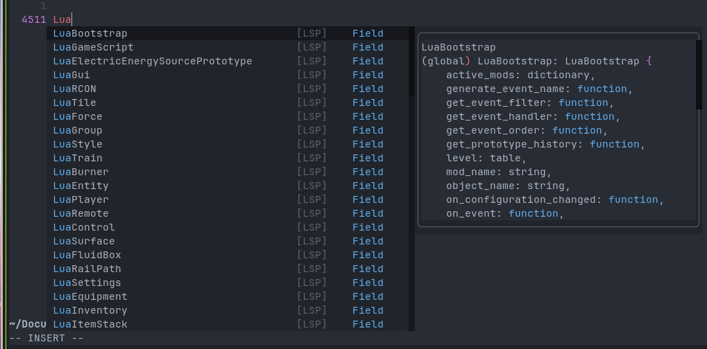

# Factorio API Scraper 

Web scraper for the factorio api with the intention of creating a 
`factorio_stubs.lua` file that contains all annotated Classes, Prototypes,
Events, Concepts, and globally defined objects to be able to get auto 
completion and type awareness when creating factorio mods.

## This is a work in progress and nowhere near production ready!!

## Requirements
- BeautifulSoup
- Jinja
- requests and grequests 

### Optional
- [lua-format](https://github.com/Koihik/LuaFormatter) because my jinja 
templates are messy

## Scripts
`scraper.py` - responsible for the scraping
`stub_generator.py` - responsible for generating `stubs.lua` file

## Examples

global script auto complete

consts/defines autocomplete

In game classes autocomplete

